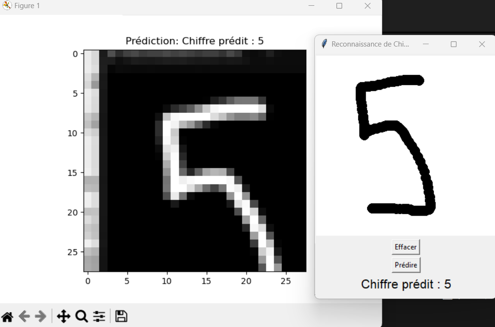
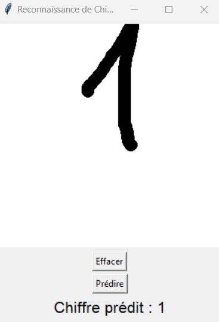
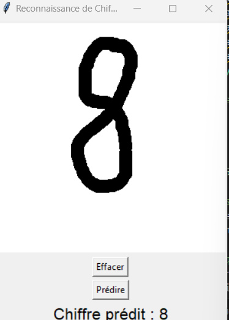
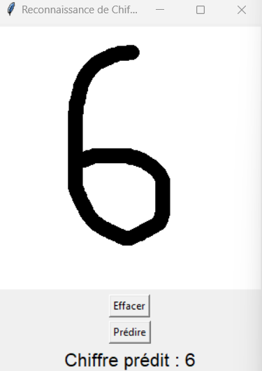
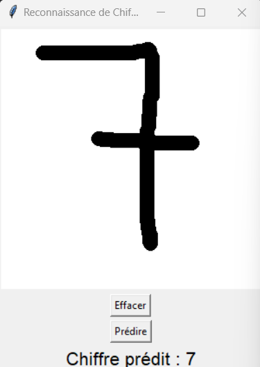
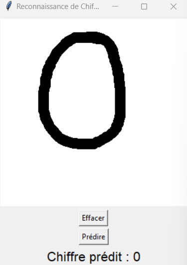
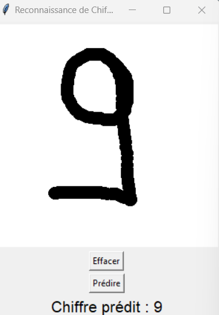

# Handwritten Digit Recognition

This project demonstrates a complete pipeline for handwritten digit recognition using a Convolutional Neural Network (CNN) trained on the MNIST dataset. The system includes an interactive graphical user interface (GUI) where users can draw a digit, and the model predicts the drawn digit in real-time.


---

## Features

- **Dataset**: Utilizes the MNIST dataset, consisting of 70,000 grayscale images of handwritten digits (28x28 pixels).
- **Model Architecture**: A convolutional neural network optimized for image classification.
- **GUI**: A Tkinter-based graphical user interface where users can draw digits and get predictions.
- **Model Accuracy**: Achieved high accuracy on the test dataset due to data augmentation and hyperparameter optimization.
- **Data Augmentation**: Includes transformations like rotation, zoom, and shifting to improve model generalization.

---

## Prerequisites

Ensure you have the following installed:

- Python 3.8 or higher
- TensorFlow
- Keras
- NumPy
- Matplotlib
- Tkinter (usually pre-installed with Python)
- Pillow

You can install the required libraries using the following command:

```bash
pip install tensorflow numpy matplotlib pillow
```

---

## Installation and Setup

1. Clone the repository:

    ```bash
    git clone https://github.com/DavidLUTALA/Systeme-de-Reconnaissance-des-chiffres-manuscrits.git
    ```
    ```bash
    cd Systeme-de-Reconnaissance-des-chiffres-manuscrits.git
    ```

2. Train the model (if not already trained):

    ```bash
    python train_model.py
    ```
    This will train the CNN model on the MNIST dataset and save it as `mnist.h5`.

3. Launch the GUI application:

    ```bash
    python gui_digit_recognizer.py
    ```

---

## Project Structure

- **train_model.py**: Contains the code to load the MNIST dataset, train the CNN model, and save the trained model.
- **gui_digit_recognizer.py**: Implements the Tkinter GUI for real-time digit recognition.
- **mnist.h5**: Pre-trained model saved in HDF5 format (generated after training).
- **README.md**: Detailed documentation of the project.

---

## Usage

1. Run the GUI application using:

    ```bash
    python gui_digit_recognizer.py
    ```

2. A window will appear with a canvas where you can draw digits.
3. After drawing a digit, click on the **Predict** button to see the model’s prediction.
4. Clear the canvas using the **Clear** button to draw another digit.

---

## Model Architecture

The CNN model used in this project has the following layers:

1. **Convolutional Layer**: Extracts features from the input image.
2. **MaxPooling Layer**: Reduces the spatial dimensions while retaining important features.
3. **Flatten Layer**: Converts the 2D feature maps into a 1D vector.
4. **Dense Layers**: Fully connected layers for classification.

---

## Results

- **Training Accuracy**: ~75%
- **Test Accuracy**: ~74%
- **Interactive Prediction**: Real-time digit recognition with consistent accuracy.

---

## Future Improvements

- Extend the application to recognize multi-digit sequences.
- Add support for custom datasets.
- Deploy the application as a web or mobile app.

---

## Contributing

Contributions are welcome! Feel free to fork the repository and submit a pull request for any improvements or bug fixes.

---

## License

This project is licensed under the MIT License. See the `LICENSE` file for details.

---

## Acknowledgments

- The MNIST dataset is publicly available from [Yann LeCun’s website](http://yann.lecun.com/exdb/mnist/).
- Inspired by various digit recognition projects in the deep learning community.

---

## Contact

For any inquiries or suggestions, please contact [davidlutala0@gmail.com].









